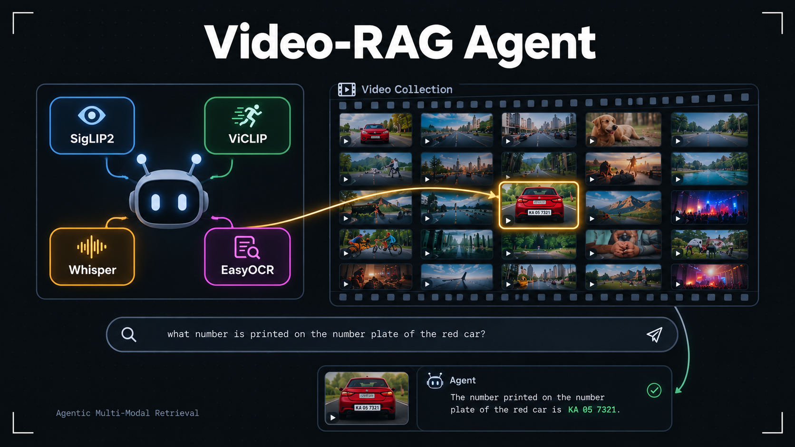

# Video-RAG Agent

**A multi-modal video retrieval agent — ask a question in plain English, and it hunts down the exact video and moment that answers it.**



<p align="center">
  <a href="https://huggingface.co/spaces/RohitMugalya/video-rag-agent"><strong>🚀 Live Demo</strong></a>
</p>

---

## What this is

Video-RAG Agent is an agentic retrieval system for a library of videos. Instead of manually scrubbing through footage, you ask a natural-language question — *"what color is the car in the video?"*, *"what does the sign say?"*, *"when does someone mention the deadline?"* — and an LLM-driven agent figures out which of its tools to call, in what order, to find and verify the answer.

## The core idea: don't run a VLM over everything

The obvious way to answer visual questions about a video library is to run a vision-language model over every video. That's also the slowest and most expensive way — a VLM call per video, multiplied across a whole library, doesn't scale.

Instead, this agent funnels candidates through progressively cheaper tools before ever reaching for a VLM:

1. **Locate** — a fast embedding-based search (visual or motion) narrows a large library down to a small handful of candidates.
2. **Confirm** — a zero-shot classifier checks each candidate against the actual claim, narrowing further.
3. **Verify** — only the few remaining low-confidence cases get escalated to a vision-language model for a final, careful check.

For a library of 100 videos and a query like "which video has a red car," this typically means the VLM runs on a handful of videos, not a hundred — the same accuracy, a fraction of the cost and latency. The agent decides this funnel dynamically per query; it isn't a fixed pipeline.

## Features

- **Chat** — ask questions in plain English; the agent plans and executes the retrieval itself.
- **Tool Trace** — see exactly which tools the agent called, with what arguments, and what came back — full transparency into the reasoning, not just the final answer.
- **Video Library** — a set of sample videos to try immediately, or upload your own (private to your session).
- **Model Information** — a breakdown of every model in the stack, what it powers, and its published benchmarks.
- Configurable agent LLM and vision-language model, selectable from the sidebar.
- Automatic retry and graceful CPU fallback when GPU allocation is temporarily unavailable, with clear in-UI messaging rather than silent failures.

## How it works

| Capability | Tool | Model |
|---|---|---|
| Spoken dialogue search | `transcript_search` | Whisper |
| Static visual search | `visual_frame_search` | SigLIP2 |
| Motion / action search | `motion_search` | ViCLIP |
| On-screen text reading | `ocr_read` | EasyOCR |
| Attribute confirmation | `zero_shot_classify` | SigLIP2 |
| Open-ended visual claim verification | `verify_visual_claim`, `describe_visual_attribute` | Vision-language model |
| Planning & orchestration | — | Large language model (agent) |

The agent is built as a ReAct-style planner (LangChain) that decides, per query, how many of these tools it actually needs — skipping straight to an answer for simple questions, and chaining multiple tools together for compositional ones (e.g., locate an object, then classify its color, then verify if the confidence is low).

## Tech stack

- **Orchestration**: LangChain agent framework
- **Interface**: Gradio
- **Deployment**: Hugging Face Spaces on ZeroGPU (on-demand GPU allocation), with a GitHub Actions pipeline that automatically syncs the repo to the Space on every push
- **Models**: Whisper, SigLIP2, ViCLIP, EasyOCR (local inference), plus a configurable LLM and VLM served via API

## Running locally

1. Clone the repo and install dependencies:
   ```
   pip install -r requirements.txt
   ```
2. Set the required API keys as environment variables (see `.env` for the full list — you'll need keys for whichever LLM/VLM providers you intend to use).
3. Launch the app:
   ```
   python src/app.py
   ```

The first run will download and cache the local models (Whisper, SigLIP2, ViCLIP, EasyOCR), which may take a few minutes.

## Known limitations

- This project runs entirely on free-tier infrastructure — Hugging Face's free ZeroGPU allocation and free-tier LLM/VLM APIs — so occasional latency spikes or a failed call that needs a retry are expected, not a sign the system is broken.
- On-screen text and visual search are tuned for short clips; very long videos will take longer to index per query since frame extraction isn't cached across turns.
- Zero-shot classification and VLM verification are only as good as the label sets and claims the agent constructs — ambiguous or highly compositional questions can occasionally need a rephrase.

## Acknowledgments

Built on top of [Whisper](https://github.com/openai/whisper) (via faster-whisper), [SigLIP2](https://huggingface.co/google/siglip2-base-patch16-224), [ViCLIP](https://huggingface.co/OpenGVLab/ViCLIP-L-14-hf), [EasyOCR](https://github.com/JaidedAI/EasyOCR), [LangChain](https://www.langchain.com/), and [Gradio](https://www.gradio.app/), deployed on [Hugging Face Spaces](https://huggingface.co/spaces) with ZeroGPU.

---

**Author**: Rohit Mugalya
